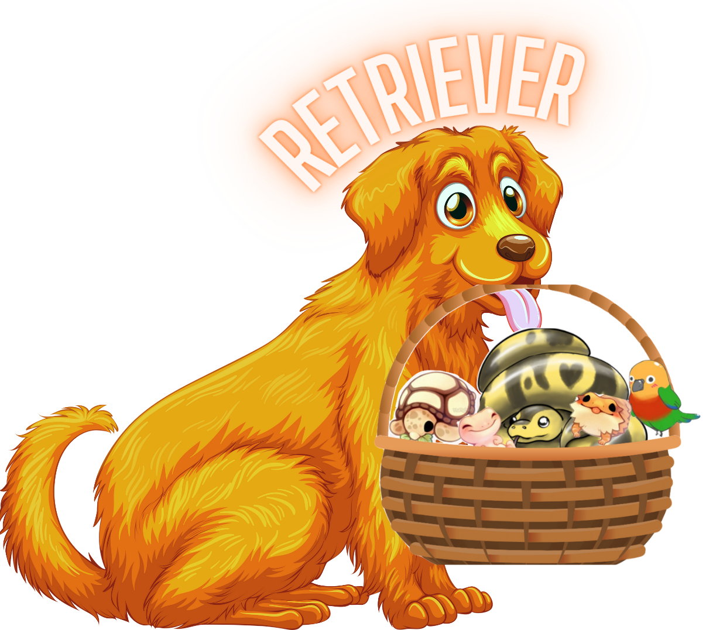
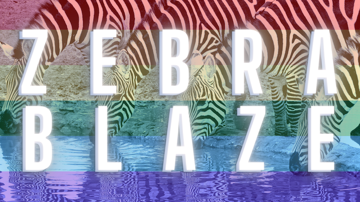
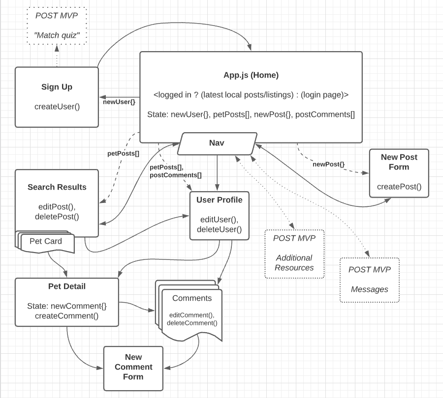
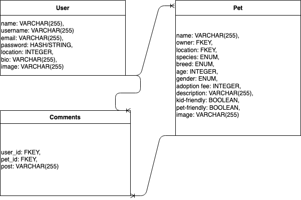

# Retriever App

## June 2021

## Created & Coded By:
[ZEe moss](https://www.linkedin.com/in/lindsey-zee-moss/) | [BRAdy roscher](https://www.linkedin.com/in/brady-roscher-291521212/) | [Bailey Leavitt](https://www.linkedin.com/in/baileyleavitt/) | [Alex ZErra](https://www.linkedin.com/in/alexander-zerra-a2737788/)

[Trello Board for Project](https://trello.com/b/47z1in78/retriever-app)
***

## Description
**Retriever App** is an app for posting and *retrieving* rescue animals, with a specific focus on exotic pets. While current apps on the market serve a similar purpose to **Retriever**, those apps are primarily marketed towards the most common pets: cats and dogs. Our app is going to fill a void in the market by serving underappreciated pets!

***

## Tech Used
PostreSQL | Express | React.js | Node.js | JavaScript (ES6) | HTML5 | CSS3

***

## Getting Started
This is where we will add the user story for our app.

***

## Game Design

***

## Screenshots from Retriever App

***

## Frontend Requirements
- [] Home/Landing Page
- [X] Sign up form
- [X] Login form
- [] Pet posts
- [] Pet card component
- [] Comments on single pet component
- [] User profile
- [X] Nav bar

## Backend Requirements
- [X] User Authentication
- [X] POST - 'Create' pet profile
- [X] POST - 'Create' user profile
- [X] POST - 'Create' comment
- [X] GET - 'Read' all pets
- [X] GET - 'Read' searched pet profiles
- [X] GET - 'Read' user info on pet profile
- [X] GET - 'Read' comments on a pet profile
- [X] PUT - 'Update' pet profile
- [X] PUT - 'Update' user profile
- [X] PUT - 'Update' comment
- [X] DELETE - 'Delete' pet profile
- [X] DELETE - 'Delete' user profile
- [X] DELETE - 'Delete' comment

***

## Future Improvements & Additions
- Pet Matching Quiz for users
- Auto-deletion upon adoption
- MAPBOX (to show map results of pets near the user / vets)
- Messaging between users
- Pet care resources
- Comment threading (appending comments to a specific comment)
- Vet resources (use MAPBOX)
- Rescue/Vet/Pound 'verified' account
- Highlighted/promoted posts

***

## Credits
- `DRAW.IO`: [ERD](https://app.diagrams.net/)
- `LucidChart`: [CHD](https://lucid.app/)
- `Canva`: [Graphic Design for Logos](https://www.canva.com/)
- `Fiverr`: [Cute bird drawing](https://www.fiverr.com/emabrumercek/)
- `Reddit`: [Cute reptile drawings](https://www.reddit.com/r/SnakesWithHats/)
- `PixaBay`: [Open-source images](https://pixabay.com/)
- `UnSplash`: [Open-source images](https://unsplash.com/)
- `Pexels`: [Open-source images](https://www.pexels.com/)